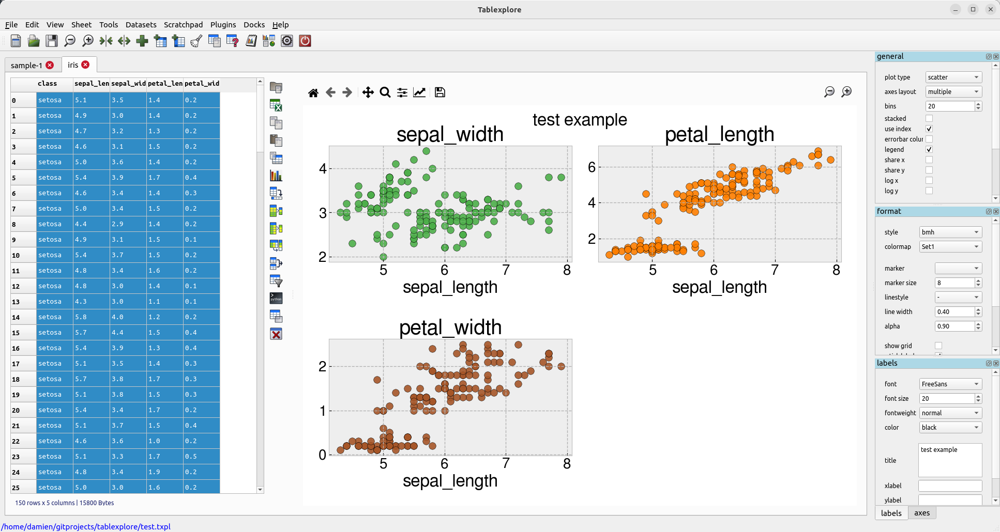

Introduction
============

Tablexplore is an application for data analysis and plotting built in Python using the PySide2/Qt toolkit. It uses the pandas DataFrame class to store the table data. Pandas is an open source Python library providing high-performance data structures and data analysis tools.

This application is intended primarily for educational/scientific use and allows quick visualization of data with convenient plotting. The primary goal is to let users explore their tables interactively without any prior programming knowledge and make interesting plots as they do this. One advantage is the ability to load and work with relatively large tables as compared to spreadsheets. The focus is on data manipulation rather than data entry. Though basic cell editing and row/column changes are supported.

Installation
============

For all operating systems with Python and pip installed::

  pip install -e git+https://github.com/dmnfarrell/tablexplore.git#egg=tablexplore

Linux
+++++

There is also a [snap](https://snapcraft.io/tablexplore) available, which can be installed using::

  snap install tablexplore

Windows
+++++++

A Windows standalone binary can be downloaded [here](https://dmnfarrell.github.io/tablexplore/).

Current features
================

* save and load projects
* import csv/hdf/from urls
* delete/add columns
* groupby-aggregate/pivot/transpose/melt operations
* merge tables
* show sub-tables
* plotting mostly works
* apply column functions, resample, transform, string methods and date/time conversion
* python interpreter

Screenshots
===========

Videos
======

* `Introduction <https://youtu.be/0_KGjrNWpb4>`_
* `Summarizing Data <https://youtu.be/acOzks3AKUQ>`_
* `Plotting <https://www.youtube.com/watch?v=ESCyyAERJ80>`_
* `Table Filtering <https://www.youtube.com/watch?v=aZjELBprGkA>`_
* `Joining tables <https://youtu.be/TDw4iS2u9Kg>`_
