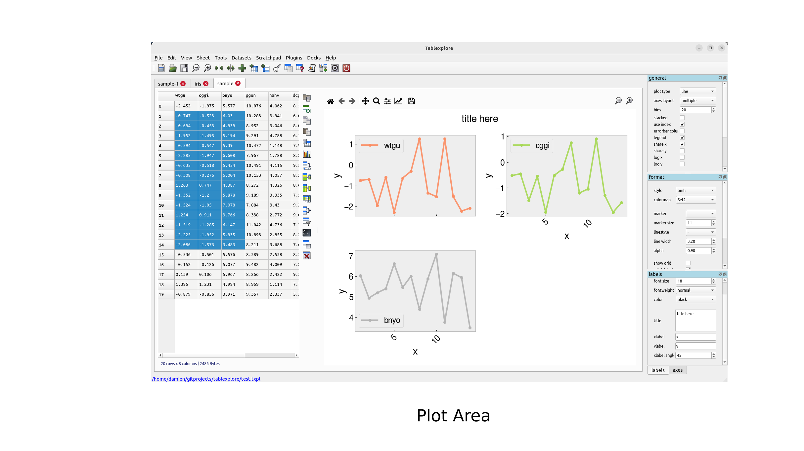
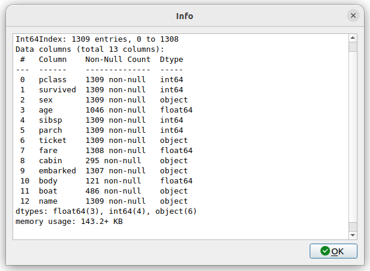
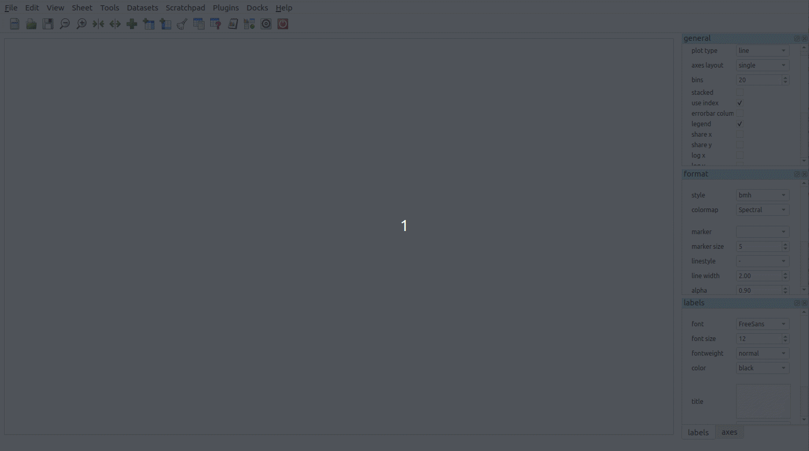
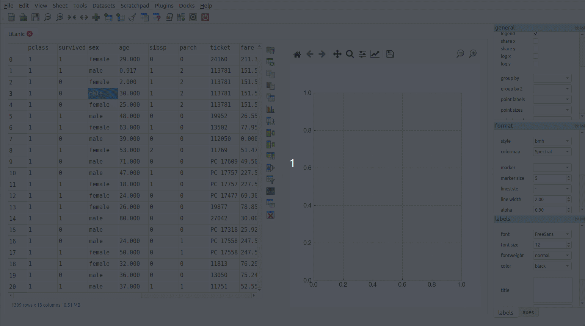
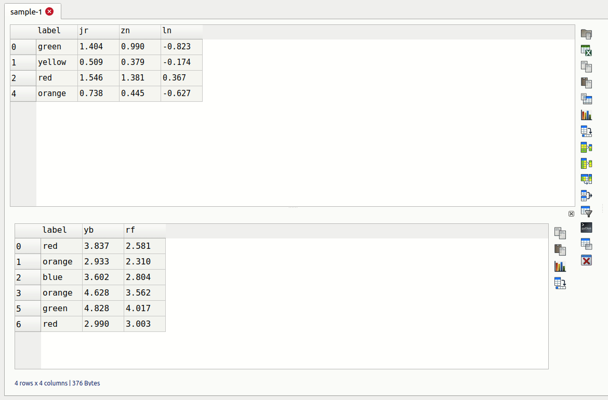
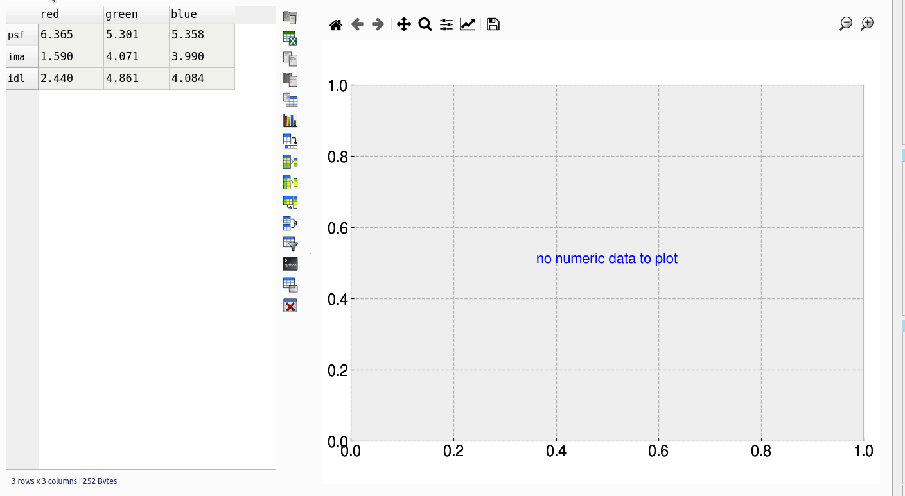
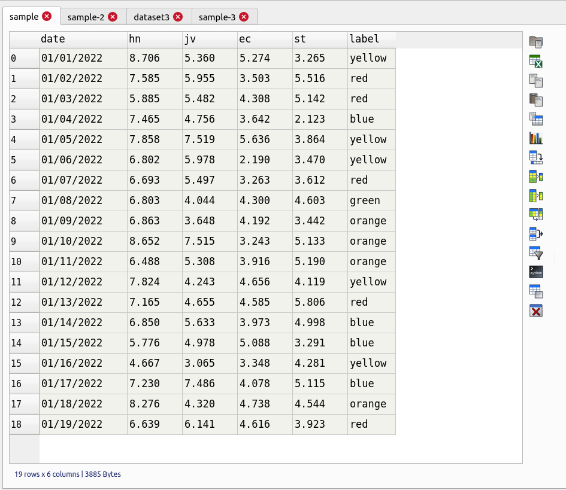
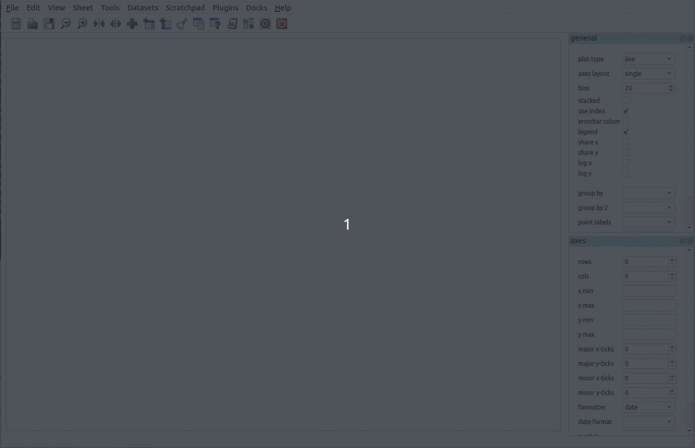
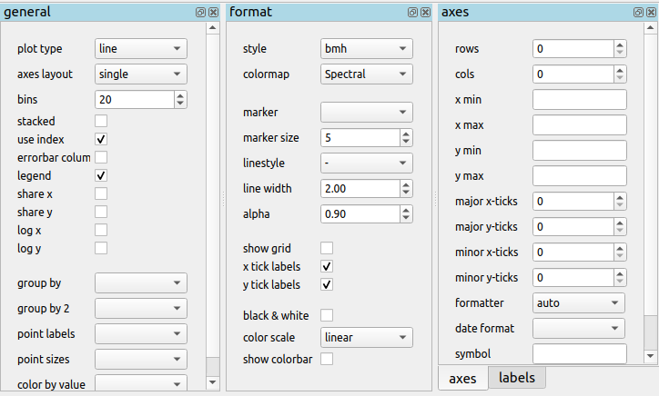
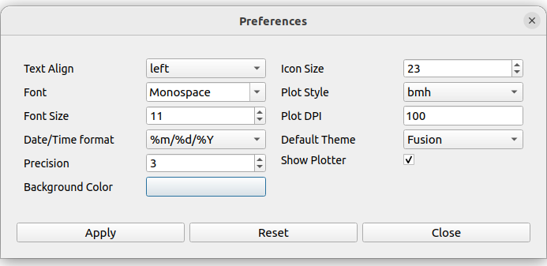

Using the Program
=================

This page details some of the tasks available in tablexplore. For a general introduction also see the screencast at https://youtu.be/Ss0QIFywt74.
Most of this functionality is available when you just use the table widget as well as the tablexplore application. Installing in windows or with a snap in linux should provide a menu item to launch the app. Otherwise use the command line, detailed below.

Purpose of the program
-----------------------

This program is for analyzing tabular data but is not meant to be a spreadsheet. Data is treated in a row/column centric fashion and a lot of the analysis is done in bulk on entire rows/columns at once. So although you can edit cells it is not especially meant for data entry. You can use a spreadsheet for that and then import the data. Cell formulas are not possible for instance. You can however delete rows, columns and clear blocks of cells. New columns can be created through the use of basic functions. The primary goal is to let users explore their tables interactively without any prior programming knowledge and make interesting plots as they do this.

Interface layout
----------------

The table is laid out with headers for row and columns. Much functionality can be accessed from the tools menu but also by right clicking on the row and column headers. You can resize columns by dragging in the header. Rows cannot be resized independently (zoom in to enlarge). Unlike spreadsheets column and row headers can use indexes (arbitrary labels). You can set any column as an index. This has extra functionality when it comes to plotting. Duplicate column name indexes are allowed though should be avoided if you want predictable behaviour. Every table has a vertical toolbar on the right and a plot view associated with it. You can make the plot hidden if needed.

Command Line
------------

Launching tablexplore from the command line allows you to provide several options using unix type '-' switches.

**Show help:**

``tablexplore -h``

**Open a project file:**

``tablexplore -p <project file>``

**Open a csv file and try to import it:**

``tablexplore -i <csv file>``

**Open an excel file and try to import it:**

``tablexplore -x <excel file>``

Import text files
-----------------

Import of csv and general plain text formats is done from the file menu, toolbar or by right-clicking anywhere in the table and using the context menu. The dialog has most basic options such as delimiter, header selection, comment symbol, rows to skip etc. When you change the import option you can update the preview to see if the new table will look correct. You then press import. Note that it is generally a good idea to remove empty lines and bad data if you can before importing.

Saving your work
----------------

tablexplore projects (multiple groups of sheets with the plot and settings for each) are saved in **pickle** format and have the .txpl file extension. The program will remember table selections also. Note: it is not recommended that you use this project format for long term backup as it is subject to change with new versions. You should *always keep a copy your raw data* if it is important. Exporting to csv is also possible and saving individual tables to excel files.

Getting table info
------------------

The status bar at the bottom left shows the size of the table in rows and columns at all times. For a more detailed summary use Tools->Table info. This brings up a window showing the type of each column and memory usage. 'object' columns are those with text/mixed data and float and int must be numbers only.

Cleaning data
-------------

Pandas supports a variety of options for data 'cleaning' or dealing with missing data. The most basic are available in tablexplore from the main menu.

* Drop rows/columns with missing (empty) data
* Fill missing data with a symbol
* Forward or backfill with neighbouring row values
* Interpolate missing data (filling in the points between)
* Drop duplicates

String operations
-----------------

Accessed by right clicking on the column header menu. String operations can be carried out on any column as long as they are object data types and not pure numbers.

The following string methods are supported:

* split, with separator symbol - will create multiple new columns
* strip, remove whitespace
* lower/upper case conversion
* title, convert to TitleCase
* swap case
* get length of string
* concat, concatenate strings in first two cols with given separator
* slice, slice string by start/end indexes
* replace

Summarizing and grouping data
-----------------------------

For overall table statistics you can use the tools->describe table command. For individual columns you can get value counts by right clicking on the header.

The primary way to summarize data is to use the aggregate dialog. It is accessed on the right toolbar. Tables can be grouped and aggregated on multiple columns to create new summary tables. The results will be placed in the sub table below the main one and can then be copied to new sheets. Normally you would group by category columns (rather then a continuous variable like decimal numbers). The dialog has a list of columns to group by and another list box for column(s) to aggregate these groups using one or more functions. See the animated example (click to enlarge):

It is often easiest to test the selections out until you get the required result.

Pivoting tables
---------------

Pivot tables is an operation some people might be familiar with from excel. A pivot might best be described as way of summarizing data by 'unstacking' the grouped data into new columns. It is a more specialized version of the aggregation method above. A comprehensive explanation is given here: https://www.dataquest.io/blog/pandas-pivot-table/ The example below shows the titanic data being pivoted to show average ages per sex by pclass.

Merging two tables
------------------

Merging tables is done in tablexplore by first putting your second table in the sub-table below. You can do that by pasting it from another sheet or making an empty sub-table and importing. Once this is done you open the merge dialog in the toolbar. You select which columns in each table to merge on (at least one columns should be shared between each). The apply and the result is opened in the dialog to preview. You can copy this to a new sheet.

Transpose tables
----------------

A transpose is rotating the table on its axes so the rows become columns and vice versa. This can be useful for plotting purposes when you want to treat the row data as series. This is illustrated in the animation below. Your row index will become the new columns when you transpose, so you should make sure the **correct index is set** beforehand. If you make a mistake you can undo or transpose again to reverse. Note: transposing extremely large tables might be slow.

Filtering tables
----------------

Filtering tables is done using either a string query and/or one or more pre-defined filters defined with widgets.

Filter with widgets
+++++++++++++++++++

Pressing the filtering button will bring up the dialog below the table. Manual predefined filters can be added by pressing the + button. These are used alone or in conjunction with the string query as shown below. The filters are joined together using the first menu item using either 'AND', 'OR' or 'NOT' boolean logic. When filtered results are found the found rows are highlighted. You can also limit the table to show the filtered set which can be treated as usual (i.e. plots made etc). Closing the query box restores the full table. If you want to keep the filtered table you can copy and paste in another sheet.

String filter
+++++++++++++

String based queries are made up fairly intuitive expressions in Python syntax. The one caveat is that column names cannot contain spaces to be used in an expression. It is best in these cases to convert column names (i.e. replace spaces with an underscore '_'). You may also use Python/pandas style expressions to perform filters, useful with string based queries.

Examples of string filters::

    x>4 and y<3 #filter by values of columns x and y
    x.str.contains("abc") #find only values of column x containing substring #abc
    x.str.len()>3 #find only rows where length of strings in x is greater than 3

Example of usage:

Applying functions
------------------

Unlike a spreadsheet there are no cell based formulas. Rather functions are applied to columns over all rows, creating a new column. New columns can be created in several ways through computations on other columns. The column header menu provides some of these like resample/transform a column or the apply function dialog. Another more general way to add functions is to use the calculation button on the toolbar. This brings up a dialog below the table where you can type function as text expressions.

Supported functions in expressions:  sin, cos, tan, arcsin, arccos, arctan, sinh, cosh, tanh, log, log10, exp

Converting column names
-----------------------

It may sometimes be necessary to re-format column names, for example to remove unwanted characters. If you have dozens or more columns this would be time consuming, so there is a function in tablexplore to do this in one step. Accessed from Tools->Convert column names, this dialog allows you to replace characters e.g. replace spaces with '_' symbol. You can also convert cases.

Resampling columns
------------------

Resampling is a way to average data over specific windows or periods. It is a possible way to smooth out noisy data for example or get an average trend. You can resample columns from the column header menu. In the example below we create a date column and then use resampling to smooth out the data in another column using a window of 7.

Plot options
------------

The plot options are a series of docked widgets on the right side of the plot, grouped by functionality. The docks can be dragged to the other sides of the application window or closed. Re-opening is done from the dock menu. Most default formatting options such as the type of plot, whether to show a legend etc. are in the 'general' tab. If you use the program regularly you will be familiar with where things are.

The following plot types are currently supported:

* line
* bar
* barh
* scatter
* pie
* histogram
* box plot
* dot plot
* heatmap
* area
* hexbin
* contour
* scatter matrix

Plotting grouped data
---------------------

Rather than grouping the table directly and then plotting, it is also possible to plot data grouped. This requires you select the appropriate columns including the one to be grouped by and select the grouping column in the 'groupby' menu in the plot options. Plots can be grouped by 1-2 columns at once.

Setting preferences
-------------------

Application settings are set from the Edit->Preferences menu. The image below shows the settings which are mostly self explanatory. If settings get corrupted or you want to restor defaults use the 'reset' button.

